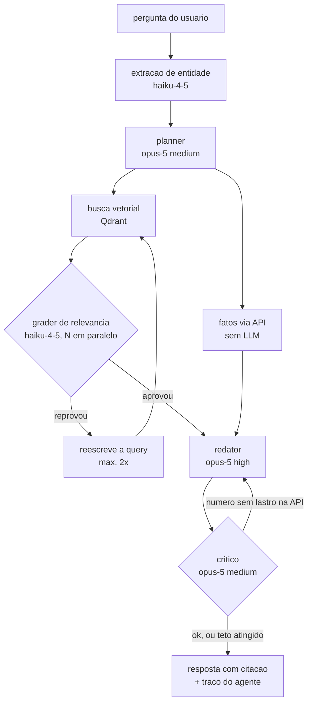

# Arquitetura

## Objetivo

Um índice vetorial único, atualizado com dados da rodada atual de um campeonato, consultado por
um **agente multi-etapa** que atende dois modos de pergunta:

1. **Rodada atual** — o que está acontecendo na rodada em andamento.
2. **Forma do time** — como um time específico está de fase, com peso maior para jogos recentes.

Este documento descreve o desenho fechado em 2026-09-08. As decisões que o produziram estão
registradas em [Decisões](#decisões), no fim.

## O sistema em runtime



O paralelismo real está em dois pontos: o fan-out entre a API estruturada e a busca vetorial, e o
grader julgando vários trechos de uma vez.

### Os nós

| Nó | Papel | Modelo |
|---|---|---|
| Extração de entidade | qual time, qual competição, qual rodada | `claude-haiku-4-5` |
| Planner | decide o plano e quais ferramentas chamar | `claude-opus-5`, effort `medium` |
| Fatos via API | placar, tabela, jogos — determinístico, sem LLM | — |
| Busca vetorial | trechos candidatos de notícia/súmula | embedding `text-embedding-3-small` |
| Grader de relevância | julga cada trecho recuperado, em paralelo | `claude-haiku-4-5` |
| Redator | escreve a resposta citando as fontes | `claude-opus-5`, effort `high` |
| Crítico | confere cada número contra os fatos da API | `claude-opus-5`, effort `medium` |

Os modelos vivem em `src/config/models.js`, uma linha por etapa, para serem trocados e medidos.

### Os dois loops de feedback

- **Grading de documentos** (*Corrective RAG*): antes de gerar, o grader reprova trechos
  irrelevantes; se sobrar pouco, a query é reescrita e a busca refeita. **Teto: 2 reescritas.**
- **Self-check da resposta**: depois de gerar, o crítico confere cada número contra os fatos
  vindos da API. **Teto: 1 refação.**

**No teto, o sistema responde — nunca falha.** A resposta sai marcada como baixa confiança,
dizendo o que não foi encontrado. Um RAG que diz "não achei contexto sobre X, os dados abaixo
vêm só da tabela" é mais útil que um que estoura.

## Regras de design que atravessam todas as tarefas

- **Fatos exatos (placar, tabela, resultado) sempre vêm de chamada direta à API estruturada.**
  O índice vetorial nunca é a fonte de um número exato — só de contexto e narrativa. Isso não é
  só uma convenção: está no contrato das ferramentas (`fetch_facts_api` devolve números,
  `search_vector_context` devolve narrativa) e é verificado em runtime pelo crítico.
- **Toda resposta gerada cita a fonte** (case/notícia) de onde a informação veio.
- **A infraestrutura (pipeline + índice) é compartilhada.** Os dois modos de consulta são
  configurações de retrieval diferentes sobre o mesmo índice, não pipelines separados.
- **Orquestração à mão.** Nós são funções `async` comuns, o estado é um objeto que atravessa o
  grafo, o paralelismo é `Promise.all`. Sem framework de agente — o projeto é de aprendizado, e
  framework esconde exatamente a parte que interessa ver.

## Idioma e glossário

**Código em inglês, prosa em português.** Identificador (função, variável, arquivo, diretório,
campo de schema, chave de JSON, nome de teste, mensagem de erro, comentário) é em inglês; spec,
doc e explicação são em português. Um schema é código: `{ homeTeam, awayTeam, score }`, nunca
`{ time_casa, time_fora, placar }`.

Para os termos de domínio não se retraduzirem a cada arquivo, a tradução é fixa:

| Português | Inglês | | Português | Inglês |
|---|---|---|---|---|
| jogo, partida | `match` | | trecho | `passage` |
| rodada | `matchweek` | | súmula | `matchReport` |
| placar | `score` | | notícia | `article` |
| time | `team` | | fonte | `source` |
| casa / fora | `home` / `away` | | ingestão | `ingestion` |
| tabela | `standings` | | consulta | `query` |
| escalação | `lineup` | | traço | `trace` |
| competição | `competition` | | nó | `node` |
| encerrado / agendado | `finished` / `scheduled` | | fatos | `facts` |
| forma (do time) | `form` | | decaimento temporal | `timeDecay` |
| times mencionados | `mentionedTeams` | | avaliação | `eval` |
| publicado em | `publishedAt` | | similaridade | `similarity` |
| crônica | `chronicle` | | pré-jogo | `preview` |
| em andamento | `live` | | estádio | `venue` |
| apelido | `nickname` | | temporada | `season` |
| pergunta | `question` | | resposta | `answer` |
| estado | `state` | | grafo | `graph` |
| plano | `plan` | | modo | `mode` |
| data | `date` | | ponto (Qdrant) | `point` |
| confiança | `confidence` | | limiar | `threshold` |

Os nós do agente mantêm os nomes já usados neste documento: `planner`, `grader`, `writer`
(redator), `critic` (crítico), `entityExtraction` (extração de entidade).

As duas ferramentas do agente: `fetch_facts_api` (fatos exatos) e `search_vector_context`
(narrativa).

Termo novo que não estiver aqui entra nesta tabela na mesma tarefa que o introduziu.

## Fórmula de scoring (a refinar nas tarefas 04/05)

```
score = similaridade_semantica x peso_metadado x decaimento_temporal
```

Cada modo de consulta ajusta os pesos e os filtros rígidos, mas usa a mesma fórmula base.

## Como saber se melhorou

Sem medição, "ficou melhor" é opinião — e com LLM no meio, a mesma pergunta responde diferente
duas vezes. Duas redes:

- **Conjunto de avaliação** (~15 perguntas com os trechos que deveriam ser recuperados), medindo
  `recall@k`. Nasce na tarefa 00, onde os dados são fixos e a resposta certa é conhecida de graça.
- **Teste de invariante**: nenhum número da resposta final pode não ter vindo da API. É a regra
  de ouro virando teste executável.

## Como o trabalho é organizado

Cada tarefa em `docs/tasks/` termina em algo que roda e que dá para usar — não em código
invisível. Etapas de cada tarefa: discovery → refinamento técnico → implementação → revisão →
testes.

- **Discovery** é sempre uma conversa direta com o usuário (skill `grill-me`). Nunca delegado:
  as decisões são dele, e um subagente só adivinharia defaults.
- **Refinamento → aprovação do usuário → implementação → revisão** usa os agentes definidos em
  `.claude/agents/`. A aprovação da spec é o ponto de parada do loop de entrega.
- Cada peça ganha um doc de conceito em `docs/learning/` explicando o *porquê*, não só o quê.

## Status

Desenho fechado; implementação começa pela tarefa 00 (fatia vertical). Ver `docs/tasks/`.

## Decisões

Fechadas em 2026-09-08, por grilling:

| # | Decisão |
|---|---|
| 1 | Arquitetura multi-agente (não um router, nem um agente único com tools) |
| 2 | Dois loops de feedback: grading de documentos + self-check da resposta |
| 3 | "Loops de entrega" são de **processo**: cada tarefa entrega algo rodável |
| 4 | Ensino em `docs/learning/` + explicação na conversa (não em comentários no código) |
| 5 | Porta de entrada: CLI imprimindo o traço do agente |
| 6 | Agentes nos dois planos: runtime (respondem) e dev-time (constroem o projeto) |
| 7 | Tetos: 2 reescritas no grading, 1 no self-check; sempre responder |
| 8 | Fatia vertical primeiro, com fixtures — não bottom-up |
| 9 | Orquestração à mão, sem LangGraph/Mastra |
| 10 | Modelo por etapa (tabela acima), centralizado em `src/config/models.js` |
| 11 | Três agentes de dev-time; discovery nunca delegado; spec aprovada pelo usuário |
| 12 | Conjunto de avaliação com `recall@k`, nascido na tarefa 00 |
